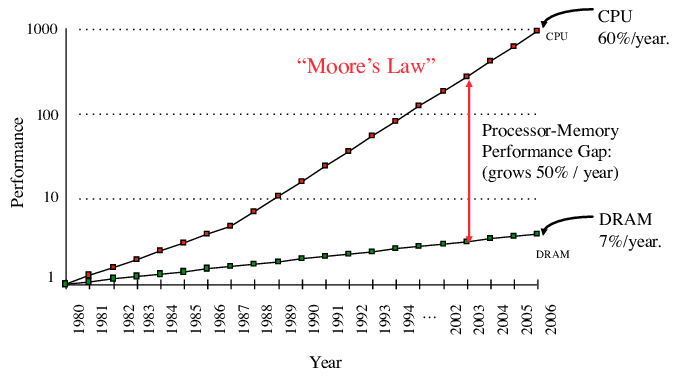

将两个数字相加需要多长时间？作为最常用的指令之一， `add` 本身只需要一个周期即可执行。因此，如果数据已经加载到寄存器中，则只需一个周期。

但在一般情况下 (`*c = *a + *b`), 我们需要先从内存中获取其操作数：

```nasm
mov eax, DWORD PTR [rsi]
add eax, DWORD PTR [rdi]
mov DWORD PTR [rdx], eax
```


当你从内存中读取任何数据，总会有延迟。而且，请求不是直接到最终的存储位置，而是先经过（用来管理内存和减少延迟的）复杂的地址转换单元和多个缓存层

因此，这个问题的唯一正确答案是“it depends”—— 主要取决于操作数存在哪里：

- 如果数据存储在主存(RAM), 大致花费 ~100ns, 或者 200 cycles, 来获取数据, 然后花费另外 200 cycles 来写回数据.
- 如果是最近访问的，它可能已被缓存，并且获取所需的时间会少于之前的时间，具体取决于它多久之前被访问——最慢的缓存层可能是 ~50 个周期，最快的缓存层可能是 4-5 个周期
- 但它也可以存储在某种类型的外部存储器上，例如硬盘驱动器, 在这种情况下，访问它大约需要 5ms, 或者几乎$10^7$ cycles .

内存性能的差异如此大是由于内存硬件不遵循与 CPU 芯片相同的硅缩放定律。内存仍在通过其他方式提高性能，但现在远远落后于指令延迟。



为了减少限制因素，现代内存系统正变得越来越分层，其中较高层以牺牲部分容量来减少延迟。由于这些特性可能会在层之间的数量级上发生变化，尤其是在外部存储器类型的情况下，因此对于许多内存密集型算法来说，首先优化其 I/O 操作变得至关重要。

这促使创建了一种新的成本模型，称为外部内存模型*external memory model*,其唯一的原始操作是块读取和写入，其他一切都具有零成本，只要它只涉及存储在有限大小的本地内存中的数据。它催生了一个令人兴奋的外部存储器算法新领域，我们将在本章中研究。